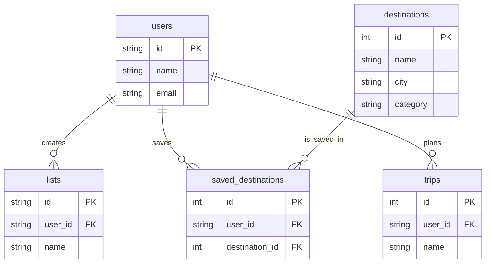

# Supabase Database Documentation - Urban Manual

**Date:** October 30, 2025  
**Author:** Manus AI  
**Version:** 1.0

---

## Overview

This document provides a comprehensive explanation of every table in the Urban Manual Supabase database. The database is designed to support a curated travel guide, with a focus on destinations, user-created lists, and future social features.

---

## Database Schema

We have identified **8 tables** in the `public` schema. The core of the application revolves around the `destinations` table, which contains all the curated travel spots.

| Table Name | Rows | Purpose |
|--------------------|------|-------------------------------------------------------|
| `destinations` | 921 | Core table containing all curated travel destinations |
| `lists` | 1 | User-created lists of destinations |
| `trips` | 0 | (Empty) Future feature for travel itineraries |
| `saved_destinations` | 0 | (Empty) User-saved or bookmarked destinations |
| `activities` | 0 | (Empty) User activity feed (e.g., saves, reviews) |
| `user_sessions` | 0 | (Empty) User login sessions |
| `reviews` | 0 | (Empty) User reviews of destinations |
| `comments` | 0 | (Empty) User comments on destinations or lists |

---

## Table Explanations

### 1. `destinations`

This is the most important table in the database. It stores all the curated travel destinations that are displayed on the Urban Manual website.

- **Rows:** 921
- **Purpose:** The central repository for all travel spots, including hotels, restaurants, and cultural venues.

**Key Columns:**

| Column | Type | Example | Description |
|-------------------------|----------|---------------------------------|----------------------------------------------------------------------------------------------------------------------------------------------------------------------------------------------------------------------------------------------------------------------------------------------------------------------------------------------------------------------------------------------------------------------------------------------------------------------------------------------------------------------------------------------------------------------------------------------------------------------------------------------------------------------------------------------------------------------------------------------------------------------------------------------------------------------------------------------------------------------------------------------------------------------------------------------------------------------------------------------------------------------------------------------------------------------------------------------------------------------------------------------------------------------------------------------------------------------------------------------------------------------------------------------------------------------------------------------------------------------------------------------------------------------------------------------------------------------------------------------------------------------------------------------------------------------------------------------------------------------------------------------------------------------------------------------------------------------------------------------------------------------------------------------------------------------------------------------------------------------------------------------------------------------------------------------------------------------------------------------------------------------------------------------------------------------------------------------------------------------------------------------------------------------------------------------------------------------------------------------------------------------------------------------------------------------------------------------------------------------------------------------------------------------------------------------------------------------------------------------------------------------------------------------------------------------------------------------------------------------------------------------------------------------------------------------------------------------------------------------------------------------------------------------------------------------------------------------------------------------------------------------------------------------------------------------------------------------------------------------------------------------------------------------------------------------------------------------------------------------------------------------------------------------------------------------------------------------------------------------------------------------------------------------------------------------------------------------------------------------------------------------------------------------------------------------------------------------------------------------------------------------------------------------------------------------------------------------------------------------------------------------------------------------------------------------------------------------------------------------------------------------------------------------------------------------------------------------------------------------------------------------------------------------------------------------------------------------------------------------------------------------------------------------------------------------------------------------------------------------------------------------------------------------------------------------------------------------------------------------------------------------------------------------------------------------------------------------------------------------------------------------------------------------------------------------------------------------------------------------------------------------------------------------------------------------------------------------------------------------------------------------------------------------------------------------------------------------------------------------------------------------------------------------------------------------------------------------------------------------------------------------------------------------------------------------------------------------------------------------------------------------------------------------------------------------------------------------------------------------------------------------------------------------------------------------------------------------------------------------------------------------------------------------------------------------------------------------------------------------------------------------------------------------------------------------------------------------------------------------------------------------------------------------------------------------------------------------------------------------------------------------------------------------------------------------------------------------------------------------------------------------------------------------------------------------------------------------------------------------------------------------------------------------------------------------------------------------------------------------------------------------------------------------------------------------------------------------------------------------------------------------------------------------------------------------------------------------------------------------------------------------------------------------------------------------------------------------------------------------------------------------------------------------------------------------------------------------------------------------------------------------------------------------------------------------------------------------------------------------------------------------------------------------------------------------------------------------------------------------------------------------------------------------------------------------------------------------------------------------------------------------------------------------------------------------------------------------------------------------------------------------------------------------------------------------------------------------------------------------------------------------------------------------------------------------------------------------------------------------------------------------------------------------------------------------------------------------------------------------------------------------------------------p>

| `id` | `int` | `968` | Unique identifier for each destination. |
| `name` | `str` | `11 Howard` | The name of the destination. |
| `slug` | `str` | `11-howard` | URL-friendly identifier. |
| `city` | `str` | `new-york` | The city where the destination is located. |
| `category` | `str` | `Hotel` | The type of destination (e.g., Hotel, Dining, Culture). |
| `description` | `str` | `Chic, minimalist rooms...` | A short description for display on cards. |
| `content` | `str` | `Chic, minimalist rooms...` | A longer, more detailed description for the detail page. |
| `image` | `str` | `https://framerusercontent.com/...` | The primary image URL. |
| `country` | `str` | `United States` | The country of the destination. |
| `vibe_tags` | `list` | `["modern", "stylish"]` | Tags describing the atmosphere or style. |
| `keywords` | `list` | `["hotel", "design"]` | SEO keywords for search. |
| `ai_summary` | `str` | `A stylish boutique hotel...` | AI-generated summary of the destination. |
| `data_quality_score` | `int` | `50` | An internal score for data completeness. |

**Usage:**
- This table is queried to display the main grid of destinations on the homepage.
- The `slug` is used to create the URL for each destination's detail page.
- Filters on the site use the `city` and `category` columns.

---

### 2. `lists`

This table stores user-created lists of destinations. For example, a user could create a list called "Tokyo Favorites" and add destinations to it.

- **Rows:** 1
- **Purpose:** Allows users to group destinations into personal collections.

**Key Columns:**

| Column | Type | Example | Description |
|------------------|----------|--------------------------------------|----------------------------------------------------|
| `id` | `str` | `fb722f7d-99e5-49b7-b4fa-...` | Unique UUID for the list. |
| `user_id` | `str` | `3f081888-7686-4c02-a05a-...` | The ID of the user who created the list. |
| `name` | `str` | `Tokyo Favs` | The name of the list. |
| `is_public` | `bool` | `True` | Whether the list is visible to other users. |

**Usage:**
- This table is used on the "Lists" page of the site.
- It has a many-to-many relationship with `destinations` (likely through a join table that is not yet created or populated).

---

### 3. `trips`

This table is currently empty but is intended to store user-created travel itineraries.

- **Rows:** 0
- **Purpose:** A future feature to allow users to plan trips by adding destinations to a timeline.

**Expected Columns:**
- `id`: Unique ID for the trip.
- `user_id`: The user who owns the trip.
- `name`: Name of the trip (e.g., "Japan 2026").
- `start_date`: The start date of the trip.
- `end_date`: The end date of the trip.
- `destinations`: A list of destination IDs included in the trip.

**Usage:**
- This will power a future "Trips" or "Itineraries" feature.

---

### 4. `saved_destinations`

This table is currently empty but will store destinations that users have saved or bookmarked.

- **Rows:** 0
- **Purpose:** To allow users to save destinations for later.

**Expected Columns:**
- `id`: Unique ID for the saved item.
- `user_id`: The user who saved the destination.
- `destination_id`: The ID of the saved destination.
- `created_at`: Timestamp of when it was saved.

**Usage:**
- This will power the "Saved" or "Favorites" page for logged-in users.

---

### 5. Other Tables (Empty)

The following tables are also present in the database but are currently empty. They are likely placeholders for future features.

- **`activities`**: To track user actions like saving, reviewing, or commenting.
- **`user_sessions`**: To manage user login sessions.
- **`reviews`**: To store user reviews and ratings for destinations.
- **`comments`**: To store user comments on destinations or lists.

---

## Relationships & Data Model

The data model is centered around `destinations` and `users` (though `users` is not yet populated).

**Explanation:**
- A `user` can create many `lists`.
- A `user` can save many `destinations` through the `saved_destinations` table.
- A `user` can plan many `trips`.

---

## Conclusion

The database is well-structured for its current purpose and has a clear path for future expansion. The core `destinations` table is rich with data, and the other tables provide a foundation for building out user features like lists, trips, and social interactions.

**Recommendations:**
- **Populate `cities` and `categories` tables:** Instead of storing city and category names as strings in the `destinations` table, it would be better to have separate `cities` and `categories` tables and use foreign keys. This would improve data integrity.
- **Create join tables:** For many-to-many relationships like `lists` to `destinations`, a join table (e.g., `list_destinations`) is needed.
- **Add user profiles:** A `profiles` table linked to the `auth.users` table would be beneficial for storing user-specific information like avatars and bios.

This analysis provides a clear understanding of your Supabase database and how it powers the Urban Manual application.

